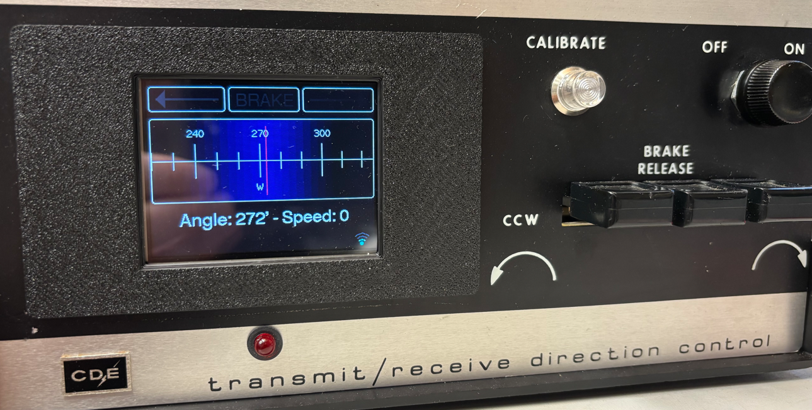
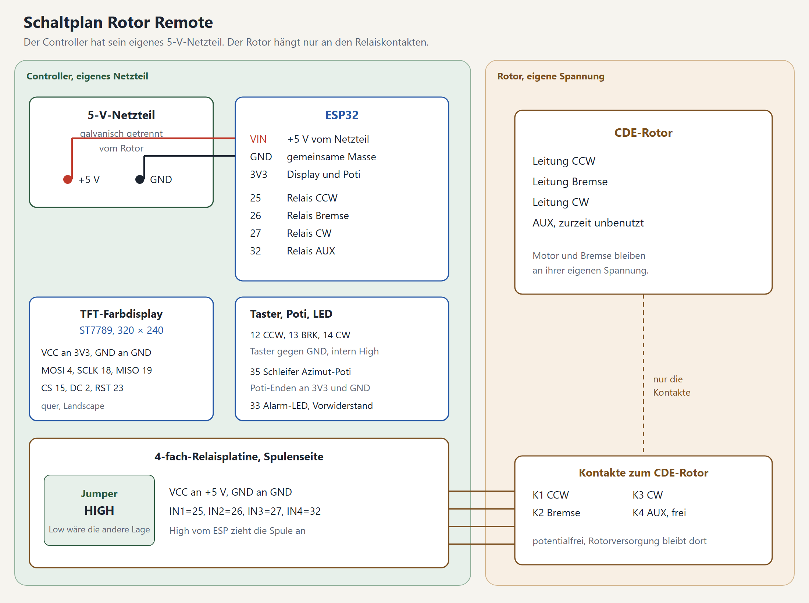

# Rotor Remote

Ein Umbau für ein vorhandenes CDE-Steuergerät. Die bisherige Steuerung wird aus dem Gehäuse entfernt. Es verbleiben das Netzteil für den Rotor und der Phasenkondensator. Die Steuerung übernimmt ein ESP32: er zeigt den Kompasswinkel auf einem Farbdisplay, drei Taster drehen von Hand, und hamlib spricht den Rotor über WLAN an. Eine Weboberfläche bedient ihn vom Handy oder PC aus und rechnet auf Wunsch ein Rufzeichen aus Wavelog in einen Kompasswinkel um. Dieselbe Steuerung gibt es über USB und Bluetooth.



Die Firmware-Version steht beim Start auf dem Display, im Systemmenü und im Kopf der Weboberfläche. Im Quelltext heißt sie `FW_VERSION` in `RotorTypes.h`.

## Was dazugehört

- **ESP32** Dev Module, 4 MB Flash. Die Partition `min_spiffs` hält zwei Programme vor, damit ein Update über WLAN möglich ist.
- **Eigenes 5-V-Netzteil** für den ESP. Damit bleibt der Controller galvanisch vom Rotor getrennt. Die Versorgung des Rotors bleibt davon unabhängig.
- **4-fach-Relaisplatine** mit Jumper für High- oder Low-Pegel. Der Jumper steht auf **High**. Die Firmware schaltet eine Spule ein, indem sie den Pin auf High legt.
- **TFT-Farbdisplay** ST7789, **320 × 240** Bildpunkte, quer eingebaut.
- **Drahtpoti** für den Azimut, drei Taster und eine Alarm-LED.

Die Relaiskontakte sind die Trennstelle. Auf der Spulenseite liegen 5 V und Masse des Controllers. Auf der Kontaktseite liegen nur die Rotorleitungen CCW, Bremse, CW und der freie AUX-Kontakt.

## Schaltplan



| Von | Nach |
| --- | --- |
| Netzteil +5 V | ESP32 VIN und VCC der Relaisplatine |
| Netzteil GND | ESP32 GND, Relais-GND, Display, Taster, Poti, LED |
| ESP32 3V3 | Display-VCC und ein Ende des Potis |
| GPIO 25, 26, 27, 32 | IN1 bis IN4, also CCW, Bremse, CW, AUX |
| Relaiskontakte K1 bis K4 | Rotor CCW, Bremse, CW, AUX |
| GPIO 4, 18, 19, 15, 2, 23 | Display MOSI, SCLK, MISO, CS, DC, RST |
| GPIO 12, 13, 14 | Taster CCW, BRK, CW, jeweils gegen GND |
| GPIO 35 | Schleifer des Azimut-Potis, Enden an 3V3 und GND |
| GPIO 33 | Alarm-LED über einen Vorwiderstand nach GND |

Die Display-Pins stehen im ESP32-Block von `libraries/TFT_eSPI/User_Setup.h`. USB-Serial läuft mit 115200 Baud. Das ist die Kommandoschnittstelle. Geflasht wird mit 921600 Baud.

AUX ist verdrahtet und als Ausgang gesetzt. Die Firmware schaltet ihn im normalen Betrieb nicht.

## Am Gerät

Auf der Hauptseite drehen **CCW** und **CW**, solange der Taster gehalten wird. **BRK** drei Sekunden gedrückt öffnet das Menü. Im Menü wählen CCW und CW die Zeile. Ein kurzer Druck auf BRK bestätigt, drei Sekunden gehen eine Ebene zurück. Unter der Liste erklärt eine graue Hilfezeile die gewählte Zeile. Bei der Kalibrierung zeigt sie stattdessen den Fortschritt.

- **Link** wählt Bluetooth oder WLAN, nie beides. Die Auswahl wird beim Verlassen des Menüs gespeichert, dann startet der Controller neu.
- **Wi-Fi** nimmt SSID, Passwort, DHCP oder eine feste Adresse, Gateway, Maske, DNS und den rotctld-Port. Speichern verbindet neu. Steht der Link auf Bluetooth, merkt sich Speichern den Wechsel auf WLAN, der beim Verlassen des Menüs gilt.
- **Bluetooth** wählt Bluetooth (mit Neustart beim Verlassen des Menüs) und stellt den Gerätenamen ein.
- **Calibration** zeigt Rohwert, Median und Geschwindigkeit. Von hier aus fährt der Rotor von Hand an die Anschläge, speichert Max CCW und MAX CW, setzt den Overshoot und startet die Auto-Kalibrierung.
- **System** zeigt Version und OTA-Adresse, stellt die Median-Länge ein, schaltet Debug und startet neu.

Alles bleibt im Speicher unter dem Namen `RotorRemote`.

### Hauptseite am Display

Nach dem Einschalten zeigt das Display kurz Name, Firmware-Version und Link-Modus. Danach folgt die Hauptseite:

- Oben stehen die Pfeile für CCW und CW und in der Mitte der Bremsstatus: `BRAKE ON` im Stand, `BRAKE OFF` in Grün, solange die Bremse offen ist und der Rotor dreht.
- Die Skala zeigt den Kompasswinkel. Läuft eine Autorotation, markiert ein gelber Strich das Ziel. Liegt es außerhalb der Skala, zeigt ein gelber Pfeil am Rand die Richtung.
- Darunter stehen Winkel mit Himmelsrichtung und die Geschwindigkeit in °/s. Der Winkel wird orange, wenn er höchstens 15 ° vom Anschlag entfernt ist, und rot ab 3 °. Das gilt nur bei gültiger Kalibrierung. Das Bild wird im Stand alle 2 Sekunden erneuert, während der Fahrt alle 250 ms.
- Die Fußzeile links zeigt die Alarme `ROTOR STUCK!` und `SENSOR GLITCH` in Rot. Sonst steht dort `Goto <Winkel>` während einer Autorotation, im Stand bei WLAN die IP-Adresse.
- Rechts in der Fußzeile stehen die Link-Symbole. Das kleine Monitor-Symbol neben dem WLAN-Symbol ist grau, solange rotctld wartet, und grün, solange ein Client verbunden ist.

Im Menü zeigen kleine Pfeile am rechten Rand, dass oberhalb oder unterhalb weitere Zeilen liegen.

## Fahren und Anschläge

CW erhöht die ADC-Digits, CCW senkt sie. `az_min_digit` ist Max CCW, `az_max_digit` ist MAX CW.

Handfahrt und Autorotation bleiben 30 Digits vor diesen gespeicherten Enden stehen. Die Kalibrierung darf bis an den mechanischen Anschlag, sonst kann sie ihn nicht finden.

Die Auto-Kalibrierung erkennt den Anschlag an der Geschwindigkeit: 3 Sekunden unter 3 °/s gelten als Stopp. Danach fährt sie 28 Digits zurück und speichert den Punkt. Zuerst kommt das nähere gespeicherte Ende. Steht der Rotor schon am Anschlag, bleibt die Geschwindigkeit von Anfang an unter 3 °/s, und der Stopp gilt trotzdem.

Die Bremse zieht zuerst an, der Motor folgt nach 250 ms. Nach dem Stopp bleibt die Bremse noch 1 Sekunde angezogen.

**BRK ist der Notstopp.** Solange BRK gedrückt ist, steht der Rotor, egal ob Taster, Weboberfläche, rotctld, Bluetooth oder eine Autorotation ihn bewegt hat. Im Kalibriermenü stoppt ein BRK-Druck eine laufende Fahrt, und das Loslassen löst keine Menüauswahl aus, damit die Auto-Kalibrierung nicht neu startet. Nach dem Loslassen fährt nichts von allein weiter.

Der Overshoot von 0 bis 9 ° lässt die Autorotation etwas vor dem Ziel stehen.

## Winkel

Der ADC wird bei jedem Durchlauf der Hauptschleife gelesen, also alle paar Millisekunden. Die Schleife läuft nicht mit festem Takt, je nach WLAN-Last dauert ein Durchlauf länger.

1. Ein laufender Median nimmt kurze Spikes des Drahtpotis weg. Die Länge wird im Systemmenü eingestellt, von 3 bis 255. Der Startwert ist 100 und bleibt gespeichert. Bei einer geraden Länge mittelt das Programm die beiden mittleren Samples.
2. Ein Kalman-Filter glättet daraus den angezeigten Winkel. Im Stand, solange die Bremse offen ist, ist dieser Filter zehnmal stärker. Während der Fahrt bleibt er leicht, damit das Ziel rechtzeitig gemeldet wird.
3. Die Geschwindigkeit ergibt sich alle 100 ms aus der Winkeländerung über die letzte Sekunde, geteilt durch die echte Zeit. Die Schleife läuft nicht mit festem Takt, deshalb zählt der Zeitstempel und nicht die Anzahl der Messungen. Das Display zeigt den Betrag, auch bei CCW. Steht der Rotor, zeigt sie 0.

Der Kompasswinkel auf dem Display und über rotctld ist der absolute Winkel plus 180 °, einmal um 360 ° herumgelegt. Die gespeicherten Enden und der 30-Digit-Abstand nutzen den Median.

Weichen Rohwert und Median während der Fahrt um 300 Digits oder mehr voneinander ab, leuchten LED und Footer. Im Stand bleibt diese Prüfung aus.

## rotctld

Bei verbundenem WLAN hört der Controller auf TCP-Port 4533, sofern im Menü nichts anderes steht. Es ist immer nur ein Client verbunden. Ein neuer Client übernimmt die Verbindung. Programme mit Hamlib-Anbindung, zum Beispiel PSTRotator, steuern den Rotor darüber. Das Anfahren per Rufzeichen aus Wavelog läuft über die Weboberfläche, siehe unten.

| Befehl | Wirkung |
| --- | --- |
| `p` oder `get_pos` | Azimut und Elevation `0.0` |
| `P <az> <el>` oder `set_pos` | Fährt den Kompasswinkel an |
| `S` oder `stop` | Stoppt |
| `q` oder `quit` | Schließt den Client |
| `dump_state` | Azimut 0–360, Elevation 0–180 |
| `_` oder `get_info` | `RotorRemote` |

`tools/rotor_angle_test.py` verfährt den Rotor um einen vorgegebenen Winkel, wartet bis er steht und gibt den Winkelfehler aus.

```text
py -3 tools\rotor_angle_test.py --host 192.168.1.77 --step 40
py -3 tools\rotor_angle_test.py --targets 0,90,180,270
```

## USB und Bluetooth

Dieselben Kurzbefehle gehen an USB-Serial mit 115200 Baud und an Bluetooth. Die Antwort kommt auf beiden Wegen zurück.

| Befehl | Wirkung |
| --- | --- |
| `C` | Aktueller Kompasswinkel |
| `Mxxx` | Zielwinkel, drei Ziffern |
| `S` | Stoppt die Autorotation |
| `D` | Rohwert, Median und Kalman-Wert |
| `L` | Speichert die aktuelle Position als Minimum |
| `H` | Speichert die aktuelle Position als Maximum |
| `Ox` | Overshoot 0–9 |
| `Nname` | Bluetooth-Name, höchstens 15 Zeichen |
| `V` | Gespeicherte Werte |
| `?` | Hilfe |

## Weboberfläche

Im Browser `http://<ip>/` öffnet die Weboberfläche des Controllers. Sie braucht WLAN und läuft ohne Anmeldung. Wer im Netz ist, kann den Rotor bedienen. Die Seite hat drei Reiter: **Home**, **Wavelog** und **Update**. Im Kopf steht die Firmware-Version.

### Home

- **Status:** Azimut, Fahrtrichtung, Zielwinkel, freier Speicher und die Adresse des rotctld-Servers. Ein Abzeichen zeigt, ob ein rotctld-Client verbunden ist. Die Seite fragt den Controller alle 0,8 Sekunden ab.
- **Kompass:** Ein roter Pfeil zeigt den Kompasswinkel. Bei einer Autorotation markiert eine gelbe Marke das Ziel.
- **CCW und CW:** Der Rotor dreht, solange die Taste gehalten wird. Beim Loslassen, beim Wechsel des Fensters oder der Seite und beim Abbruch der Verbindung stoppt er. Der Controller stoppt auch von allein, wenn 0,5 Sekunden kein Signal der Taste kommt.
- **Winkel, GO und STOP:** Ein Zielwinkel von 0 bis 359 ° mit **GO** startet eine Autorotation, **STOP** hält sie an. GO wird mit „busy“ abgelehnt, solange schon eine Fahrt läuft, das Menü offen ist, kalibriert wird oder BRK gedrückt ist.
- **Rufzeichen oder Locator:** Ein Feld mit **FIND** und „long path“ rechnet das Ziel in einen Winkel um. Siehe den Abschnitt Wavelog.
- **Log:** Die letzten Befehle von rotctld und Weboberfläche, der Blockade-Alarm und BRK-Notstopps mit Datum und Uhrzeit.

Es darf immer nur ein Client fahren. Eine Fahrt startet nur mit einem frischen Tastendruck. Ein verspätetes Signal eines hängenden Browsers startet nach einem Stopp nichts neu. Ein Druck in Gegenrichtung während der Fahrt stoppt, statt umzukehren, und ein Stopp wird von jedem Client angenommen. BRK am Gerät hat immer Vorrang, und die weichen Enden gelten auch hier.

| Pfad | Zweck |
| --- | --- |
| `GET /` | Home |
| `GET /wavelog` | Einstellungen für Wavelog |
| `GET /update`, `POST /update` | Update-Seite, Firmware hochladen |
| `GET /status` | Status als JSON: `az`, `target`, `turning`, `auto`, `speed`, `dir`, `debug`, `client`, `heap`, `maxblk`, `ver`, `ip`, `port`, `log` |
| `POST /jog` | `dir=ccw`, `cw` oder `stop`. `start=1` kennzeichnet einen neuen Tastendruck, ohne `start` hält die Anfrage nur eine laufende Fahrt am Leben. |
| `POST /go` | `az=0..359` startet eine Autorotation, `stop=1` hält sie an |
| `GET /wl.json`, `POST /wl` | Einstellungen für Wavelog lesen und speichern |

### Wavelog: Rufzeichen anfahren

Die Weboberfläche rechnet ein Rufzeichen oder einen Maidenhead-Locator in einen Kompasswinkel um. Das Rufzeichen schlägt der Browser in Wavelog nach. Der Controller selbst spricht nicht mit Wavelog. Nötig ist Wavelog ab Version 3.1.0 mit der REST-API v2.

**Einrichten**

1. In Wavelog im Benutzermenü unter **API** einen **API-v2-Token** erzeugen. Er braucht die Rechte `lookup:read` und `station:read`. Der Token beginnt mit `wl2_` und wird nur einmal angezeigt.
2. In der Weboberfläche den Reiter **Wavelog** öffnen. Dort stehen die **URL** der Instanz (`https://log.example.com`, die Form `https://log.example.com/index.php/api/v2` wird ebenfalls verstanden), der **Token** und optional dein eigener **Locator**. Bleibt der Locator leer, nimmt die Seite den der aktiven Wavelog-Station.
3. **Save** speichert die Werte im Controller. **Test** prüft nacheinander Token, Station und Lookup und zeigt zum Beispiel `token ok, station JO30OO, lookup ok`. Fehlt dem Token ein Recht, nennt Wavelog es in der Meldung.

**Benutzen**

Auf **Home** ein Rufzeichen (`DL1ABC`) oder einen Locator (`JN48`) in das Feld eintragen und **FIND** drücken. Die Seite zeigt Ziel, Winkel und Entfernung und trägt den Winkel in das Winkelfeld ein. „long path“ rechnet den langen Weg. Gedreht wird erst, wenn du **GO** drückst.

Woher der Standort kommt:

- Ein Locator mit 4, 6 oder 8 Stellen wird direkt umgerechnet, ohne Wavelog. Die Rechnung nimmt die Mitte des Feldes.
- Bei einem Rufzeichen liefert Wavelog den Locator des Eintrags, sofern ein Callbook eingerichtet ist oder das Rufzeichen schon im Logbuch steht.
- Fehlt der Locator, nimmt die Seite die Landesmitte des DXCC-Gebiets und markiert das Ergebnis mit „(country centre)“. Das ist nur eine grobe Richtung.

Der Winkel ist der Kompasswinkel wie bei rotctld.

Hinweise:

- URL und Token liegen im Flash des Controllers. Jeder, der die Seite öffnen kann, kann den Token lesen. Vergib deshalb nur die beiden Leserechte. Bei einem Verdacht den Token in Wavelog widerrufen.
- Die Abfrage läuft im Browser. Handy oder PC müssen die Wavelog-Instanz erreichen. Die API v2 erlaubt dafür Zugriffe von anderen Seiten (CORS).
- Der Controller selbst braucht dafür keine Verbindung zu Wavelog.

## Update über WLAN

Der Reiter **Update** lädt die Firmware hoch. Hochgeladen wird `firmware/RotorRemote_ota.bin`. Nach dem Neustart öffnet sich die Startseite wieder und zeigt die neue Firmware-Version. Die Datei `RotorRemote.bin` ist das USB-Abbild.

Die Update-Seite lässt den Controller in Ruhe, bis die Datei gesendet wird. Dann zeigt das Display „Updating...“ mit Fortschrittsbalken und Prozentanzeige, und rotctld wird getrennt. Nach dem Schreiben erscheint „Update OK“ und der Neustart. Bricht der Upload ab, erscheint „Update failed“ mit dem Grund, und der Controller startet neu. Fällt das WLAN dabei weg, startet er nach ein paar Sekunden ebenfalls neu.

Ein USB-Flash, falls er einmal nötig ist, nutzt den ESP32 Dev Module mit `PartitionScheme=min_spiffs` und 921600 Baud. Port und Board stehen in `sketch.yaml`.

## Release erstellen

Der Build läuft auf GitHub Actions und stellt die Firmware-Dateien als Release bereit. Zwei Wege:

**Per Tag (empfohlen):**

```text
git tag v1.2.3
git push origin v1.2.3
```

Der Push des Tags startet die Pipeline. Sie baut die Firmware und erstellt ein Release `v1.2.3` mit beiden Dateien.

**Manuell:** Auf GitHub den Tab **Actions** öffnen, links **Release** wählen, oben rechts **Run workflow** drücken und eine Version wie `v1.2.3` eingeben.

In beiden Fällen wird die Version beim Bau als `FW_VERSION` eingesetzt; der Quelltext in `RotorTypes.h` wird dafür nicht geändert. Im Release ist `RotorRemote.bin` das USB-Abbild und `RotorRemote_ota.bin` die Datei für das Update im Browser.

## Bauen

Arduino CLI mit Core `esp32:esp32` 3.3.7. TFT_eSPI und RunningMedian liegen im Ordner `libraries`. Der Sketch-Ordner muss so heißen wie die Hauptdatei, also `Rotor_Remote_V1_TFT` (Hauptdatei `Rotor_Remote_V1_TFT.ino`), sonst findet Arduino CLI sie nicht.

```text
arduino-cli compile --libraries libraries --output-dir firmware .
```

Die App-Datei daraus nach `firmware/RotorRemote_ota.bin` kopieren. Das ist die Datei für das Update im Browser.
